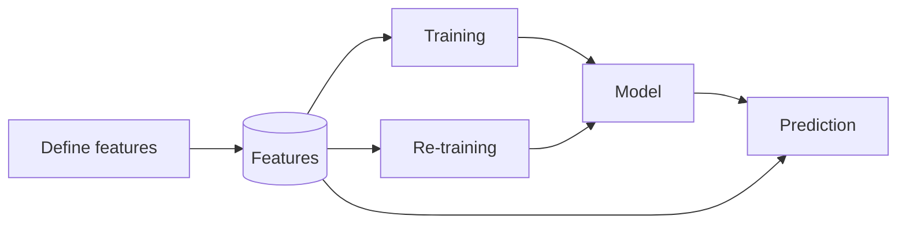
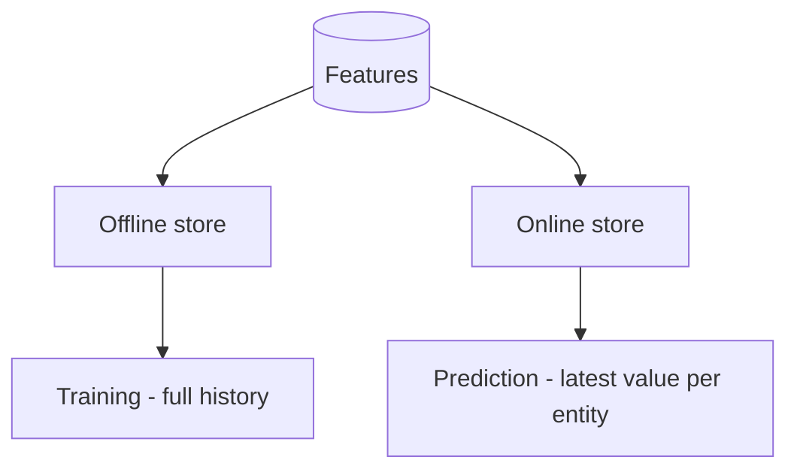
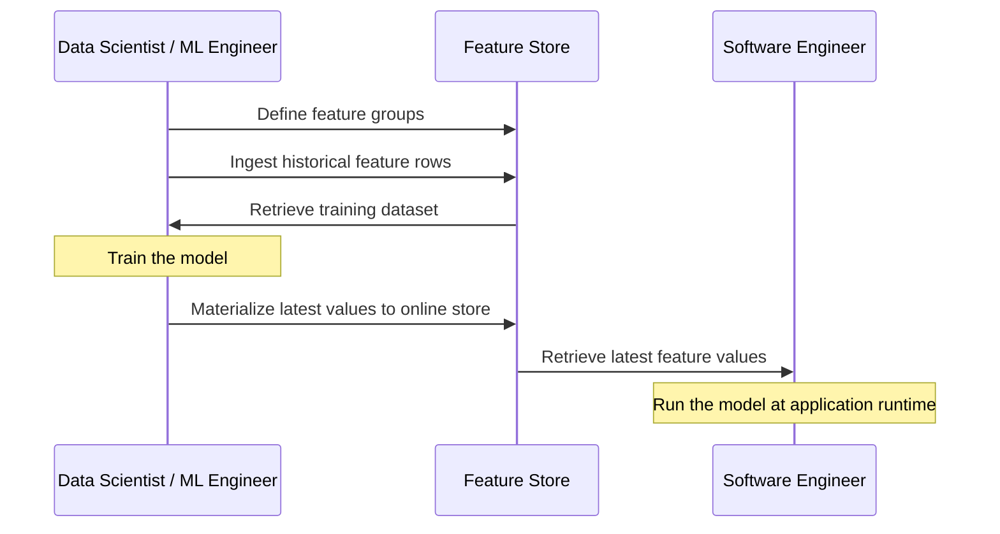
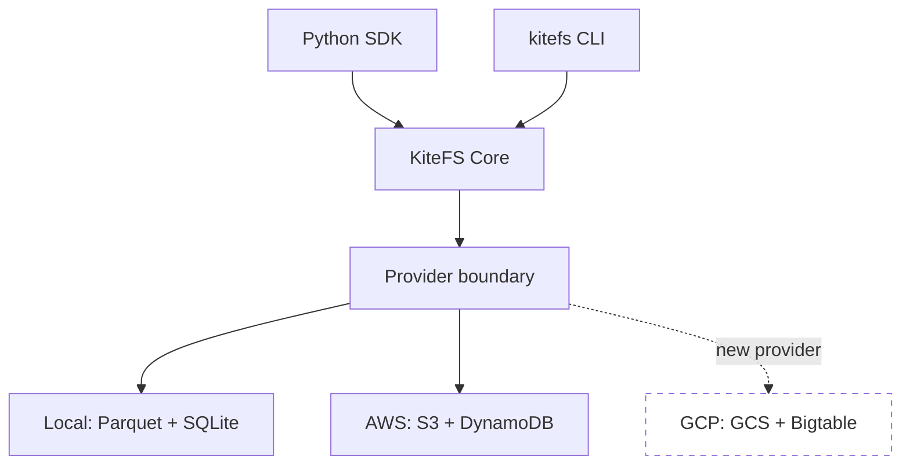
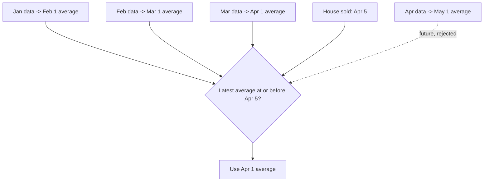

# What is KiteFS?

## What is a Feature Store?

**What is a feature?**

Assume we want a model to predict the selling price of a house.

| listing_id | town | net_area | number_of_rooms | build_year | avg_price_per_sqm |
| --- | --- | --- | --- | --- | --- |
| 1042 | Kadıköy | 95 | 3 | 2015 | 28500.0 |

These are the features a model uses to predict the selling price.

**A feature store** stores and serves the features your models need, for both training and prediction.


### The problems it addresses

- **Training–serving skew** — the same feature computed two ways gives different results.
- **Duplicated logic** — code to compute features is copied across projects and drifts apart.
- **Inference latency** — expensive features can't be recomputed on every request.
- **Data leakage** — training data accidentally includes future values.
- **No reuse** — features are hard to find, so teams rebuild them.

### Where features fit



The same features are used to train the model, to re-train it later, and to make predictions.

### Offline store and online store

A feature store keeps features in two shapes, for two jobs.



- **Offline store** — the full history, used to build training datasets.
- **Online store** — the latest value per entity, used for fast lookups at prediction time.

### What a feature store solves

- **Ends training–serving skew** — one definition feeds training and prediction.
- **Removes duplicated logic** — features are defined once and reused everywhere.
- **Cuts latency** — precomputed values are served fast.
- **Enables reuse** — features become discoverable and shareable across teams.

---

## How Teams Use a Feature Store

**Data scientists and machine learning engineers** define features and train models. 
**Software engineers** use the model and features for prediction at application runtime.

**Teams share the store, not notebooks or code.**




---

## What is KiteFS?

**KiteFS is a feature store delivered as a Python library.**

- No server to deploy
- No Docker
- No infrastructure to manage 
- Just `pip install`, define features as Python code, and have a working feature store.

```bash
pip install --pre kitefs
```

KiteFS is **library-first** and **store-first**:

- *Library-first* — it runs in your process via an SDK and a CLI, not as a service.
- *Store-first* — it stores and serves feature values

### Easy to start

- If you have worked with an ORM or a database, you already know enough.
- No Domain Specific Language to learn - just Python.
- Define features as plain Python objects and go.

---

## What KiteFS Provides

- **Feature groups as code** — reviewed Python source with typed features and built-in validation rules.
- **A registry** — definitions compiled into a deterministic, discoverable artifact.
- **An offline store** — historical rows stored as Hive-partitioned Parquet.
- **Point-in-time-correct retrieval** — training datasets with no future leakage.
- **An online store** — the latest value per entity for real-time serving.
- **Validation gates** — strict (`ERROR`), drop-bad-rows (`FILTER`), or off (`NONE`).
- **Local or cloud** — the same code runs on Parquet + SQLite, or AWS S3 + DynamoDB, with no code changes.

Two surfaces, one core:

| Surface | Used for |
| --- | --- |
| **Python SDK** — `from kitefs import FeatureStore` | Ingest, retrieve, materialize, serve in notebooks and apps. |
| **CLI** — `kitefs apply`, `ingest`, `list`, `describe`, `materialize` | Project setup, ci/cd pipelines or operational workflows. |

---

## Architecture at a Glance

- The SDK and CLI are thin surfaces over one core.
- Switching from local to cloud is a configuration change, not a code change.



A `FeatureStore()` instance reads `kitefs.yaml`, resolves one target (`local` or `remote`), and binds to it for its lifetime.

---

## Point-in-Time Join Explained

This is the idea that prevents data leakage, and it's the heart of correct training data.

**Scenario:** we run a house listing website, and we want to predict the selling price.

- House features alone — number of bedrooms, area — are not enough.
- For a good prediction we also need **market conditions**, like the average price per square meter for the town.
- That market price shifts with inflation, bank and mortgage interest rates, seasonal demand, and more.
- Assume we have the average price per town, for every month of 2025.
- A house sold on **April 5, 2025**.

**Which monthly average price should training use for this house?**

The answer: the most recent average that was already known on April 5 — not a future one. 

Lets assume, monthly aggregates become available on the **first day of the next month** (January's average is published February 1). So the March average, available April 1, is the latest valid choice. Using the April average would leak future information.



KiteFS picks the **most recent** average whose timestamp is **at or before** the sale — the April 1 snapshot — and never the future May 1 one. That keeps offline training honest.
